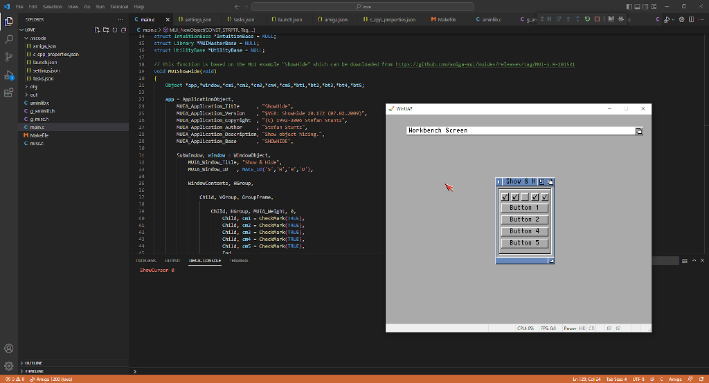
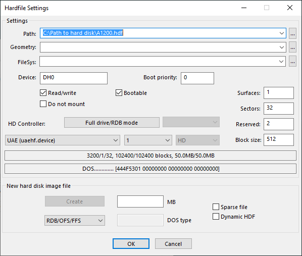

# _amiga-debug_ Visual Studio Code Extension (fork with libraries support)

This fork is based on the marvellous vscode-amiga-debug extension [vscode-amiga-debug by Bartman^Abyss](https://marketplace.visualstudio.com/items?itemName=BartmanAbyss.amiga-debug), which is also available on [github](https://github.com/BartmanAbyss/vscode-amiga-debug).

## Additional features

- Standard Amiga libraries are available (you need to specify a Workbench floppy disk or hard disk; see below).
- MUI is also included on the compilation side (SDK v3.9) and on the execution side (libraries v3.8).
- clib2 (stdlib, stdio, amigalib, etc.) is available as a set of static libs (please see https://github.com/jyoberle/clib2 for all details).
- Custom libraries can be declared through the setting of assigns.
- The bsdsocket.library of UAE can also be enabled.
- Additional commands to be added at the end of the startup-sequence can be specified.
	
## Quick-start
0. Install the extension from the Visual Studio Code Marketplace
1. Create a new empty project folder with `File > Open Folder...`
2. From the command palette <kbd>Ctrl+Shift+P</kbd> select `Amiga: Init Project With Libs`
3. Open `.vscode/launch.json` and make `"kickstart"` point to your *Kickstart 3.1* ROM and `"workbench"` to your *Workbench 3.1* floppy (.adf)
4. Hit <kbd>F5</kbd> to build and run a minimal sample project (you should see the MUI app of the above screenshot)
5. You'll also find on youtube a [video showing the previous steps](https://www.youtube.com/watch?v=qjIraPFSK_c).

## How-to-use
- In `.vscode/launch.json`, you can also make `"workbench"` point to a hard file (.hdf) containing the *Workbench 3.1*; in this case, for WinUAE, you need to specify at the end of its path its number of sectors, number of surfaces,
 number of reserved blocks, and block size (e.g. "workbench": "C:/Path to hard file/A1200.hdf,32,1,2,512") as they appear in the settings window of WinUAE (see picture below). For FS-UAE, just specify the path to the .hdf file
 (e.g. "workbench": "C:/Path to hard file/A1200.hdf").
- Both for WinUAE and FS-UAE, you can also make `"workbench"` point to a directory virtual hard disk (e.g. "workbench": "C:/Path to  directory virtual hard disk/A1200_dir").
- Still in `.vscode/launch.json`, you can specify with `"assigns"` a list of assigns (separated by commas) which will be translated in the startup-sequence; for example "assigns":"MUI: DH2:MUI,LIBS: DH2:LIBS DH2:MUI/Libs" will
 add at the end of the startup-sequence: 
assign MUI: DH2:MUI 
assign LIBS: DH2:LIBS DH2:MUI/Libs 
The purpose is to add the ability to declare your own libraries residing on your hard file or directory virtual hard disk. These latest are defined as DH2: (DH0: is a directory virtual hard drive, used for booting and where the
 startup-sequence is located, and DH1: is the directory virtual hard drive containing your compiled program). Thus, the content of DH2: is never modified.
- `"bsdSocket"` can be set to true (e.g. "bsdSocket":true) to enable the bsdsocket.library of UAE.
- At last, with `"cmdList"`, you can specify a list of commands (separated by commas) which will be added at the end of the startup-sequence, e.g. "cmdList":"df0:System/rexxmast".

Please note that if your Workbench disk doesn't have a Fonts directory, you'll have to create one (you can keep it empty), because the startup-sequence is assigning FONT: to it (it seems that some versions of the Workbench disk
 don't come with a Fonts directory).

## How-to-use clib2?
You can do a minimal test of clib2 by setting OPTION_TEST_CLIB to 1 in `main.c` (created by following the steps in the **Quick-start** section), and then press <kbd>F5</kbd>

If you want to use the clib2 libraries in your own project, your code will have to follow the skeleton of the `main.c` file:
- Check for the Workbench startup message
- Assign to the variable __WBenchMsg the value of the pointer to the Workbench startup message, or assign NULL if started from command line
- Set __exit_blocked to FALSE to push exit() and similar functions to longjmp to target set by setjmp()
- Declare and open the following libraries: Exec, intuition.library, dos.library, utility.library, graphics.library, commodities.library and icon.library
- Assign to the variable __UtilityBase the value of UtilityBase
- Set the target `out:` (which is used by `exit`) through the `setjmp` instruction
- Call all the constructors, like in the `fcntCallCtor` function (the constructors must be called in a specific order)\
At the end:
- At the `out:` target, call the destructors, like in the `fcntCallDtor` function (the destructors must also be called in a specific order)
- Close all libraries
- If needed, reply to the Workbench startup message

It is also mandatory:
- To declare the static libs in your `Makefile`:\
a. static_libs := -lc -lm -ldebug -lnet -lunix -lc -lamiga, to use Amiga style paths, or\
b. static_libs := -lm -ldebug -lnet -lunix -lc -lamiga, to use UNIX style paths (e.g. "/RAM/myfile" instead of "RAM:myfile")
- To call SetPatch in your startup-sequence
- To increase the stack size, especially if you use `libunix` (see line below)
- To mount the PIPE: device if you intend to use pipe functions (popen, pclose, etc.); this is done in `.vscode/launch.json` file through the instruction "cmdList":"C:Mount PIPE:,C:stack 16384,C:SetPatch QUIET" (which also increases the stack size)
- To have the bsdsocket.library installed in your system (it is required by `libnet`); this is done in `.vscode/launch.json` file through the instruction "bsdSocket":true
- To have at least the usergroup.library installed in your system (it is required by `libnet` for the usergroup functions); [vscode-amiga-debug](https://marketplace.visualstudio.com/items?itemName=JOB.amiga-debug-job) version 1.7.5 comes with the usergroup.library embedded in DH0:Libs
- To have AmiTCP installed in your system if you want to take full advantage of the usergroup functions (like `setuid`, `setgroups`, etc.)
- To *NOT* use `libnet` functions and native bsdsocket.library functions together, as they are incompatible; in order to avoid this, do not include "<inline/bsdsocket.h>" in your code if your intention is to use `libnet`
 
Please be also aware of the current limitations of clib2:
- `libm881` has not been tested and is provided as-is
- The function `hstrerror` is currently crashing the program when used
- ARexx functions `GetRexxVar` and `SetRexxVar` are not yet working in the current version of `libamiga`
- Neither 64 bits integers nor long double are supported
- The following functions are currently do-nothing: feclearexcept, fegetenv, fegetexceptflag, fegetround, feholdexcept, feraiseexcept, fesetenv, fesetexceptflag, fetestexcept, fetestround, feupdateenv

You'll find some examples on how to use the clib2 functions in https://github.com/jyoberle/clib2.

## How does this fork work?
- This fork has the MUI libraries included in the disk DH0: which is already used by the original vscode-amiga-debug extension to store the startup-sequence and to boot the Amiga.
- It adds the needed definitions to the UAE configuration file to declare your `"workbench"` pointing to a floppy, a hard file or a directory virtual hard disk, and to enable optionally the bsdsocket.library.
- It also adds the following instructions to the startup-sequence (when `"workbench"` points to a hard file or a directory virtual hard disk; for a floppy disk, just replace DH2: by DF0:): 
DH2:C/assign C: DH2:C 
C:assign SYS: DH2: 
C:assign S: DH2:S 
C:assign LIBS: DH2:LIBS DH0:MUI/Libs DH0:Libs 
C:assign DEVS: DH2:Devs 
C:assign FONTS: DH2:Fonts 
C:assign L: DH2:L 
C:MakeDir RAM:T RAM:Clipboards RAM:ENV RAM:ENV/Sys 
C:assign T: RAM:T 
C:assign CLIPS: RAM:Clipboards 
C:assign ENV: RAM:ENV 
C:assign LOCALE: DH2:Locale dh0:MUI/Locale 
C:assign PRINTERS: DEVS:Printers 
- At last, when you define `"assigns"`, it adds your assigns at the end of the startup-sequence (see above for an example). And in case you define additional commands with `"cmdList"`, they are also added at the end of the startup-sequence.

## Change Log (fork only)

### 1.7.5
- The clib2 library is included (from https://github.com/jyoberle/clib2) as a set of libraries in static_libs
- usergroup.library from http://aminet.net/package/util/libs/MuFS_UserGroup is available in DH0:Libs 

### 1.7.2
- Equivalent of amiga.lib, alib (from https://github.com/jyoberle/alib), included
- Added the ability to specify additional commands for the startup-sequence

### 1.7.1
- Added the ability to use a directory virtual hard disk for the workbench

### 1.6.8
- Support for libraries

## Additional credits

- Code by [JOB](https://github.com/jyoberle).

- Magic User Interface (MUI) is Copyright (C) 1992-2013 by Stefan Stuntz. Version 3.9 can be downloaded from https://github.com/amiga-mui/muidev/releases/tag/MUI-3.9-2015R1. Installation of version 3.8 is described
 on https://guide.abime.net/wb3.1/chap6.htm.
 
- Some portions of the example code are inspired by AROS code (https://github.com/aros-development-team/AROS).

- MultiUser Compatible UserGroup.library for AmiTCP 3.0+ (http://aminet.net/package/util/libs/MuFS_UserGroup) is Copyright (C) by Andrea Rafreider
