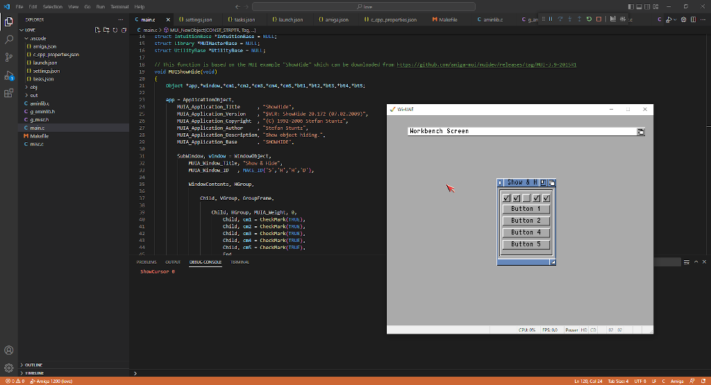
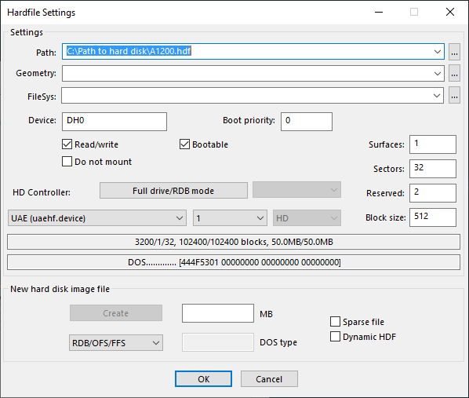

# _amiga-debug_ Visual Studio Code Extension (fork with libraries support)

This fork is based on the excellent vscode-amiga-debug extension [vscode-amiga-debug by Bartman^Abyss](https://marketplace.visualstudio.com/items?itemName=BartmanAbyss.amiga-debug), which is also available on [github](https://github.com/BartmanAbyss/vscode-amiga-debug).

## Additional features

- Standard Amiga libraries are available (you need to specify a Workbench floppy disk or hard disk; see below).
- MUI is also included on the compilation side (SDK v3.9) and on the execution side (libraries v3.8).
- clib2 (stdlib, stdio, amigalib, etc.) is available as a set of static libs (please see https://github.com/jyoberle/clib2 for all details).
- The bsdsocket.library of UAE can also be enabled.
- Development for Amiga OS 3.2 is supported.
- The startup-sequence can be fully customized.
- RTG (retargetable graphics) mode is available.
	
## Quick-start
0. Install the extension from the Visual Studio Code Marketplace
1. Create a new empty project folder with `File > Open Folder...`
2. From the command palette <kbd>Ctrl+Shift+P</kbd> select `Amiga: Init Project With Libs`
3. Open `.vscode/launch.json` and make `"kickstart"` point to your *Kickstart 3.1* ROM and `"workbench"` to your *Workbench 3.1* floppy (.adf)
4. Hit <kbd>F5</kbd> to build and run a minimal sample project (you should see the MUI app of the above screenshot)
5. You'll also find on youtube a [video showing the previous steps](https://www.youtube.com/watch?v=qjIraPFSK_c).

## How-to-use
- In `.vscode/launch.json`, you can also make `"workbench"` point to a hard file (.hdf) containing the *Workbench 3.1 or 3.2*. In this case, for WinUAE, you need to append the number of sectors, surfaces, reserved blocks, and block size to the path
 (e.g. "workbench": "C:/Path to hard file/A1200.hdf,32,1,2,512") as they appear in the settings window of WinUAE (see picture below). For FS-UAE, just specify the path to the .hdf file
 (e.g. "workbench": "C:/Path to hard file/A1200.hdf").
- Both for WinUAE and FS-UAE, you can also make `"workbench"` point to a directory virtual hard disk (e.g. "workbench": "C:/Path to  directory virtual hard disk/A1200_dir").
- `"bsdSocket"` can be set to true (e.g. "bsdSocket":true) to enable the bsdsocket.library of UAE.
- Still in `.vscode/launch.json`, you can provide a customized startup-sequence through `"startup"`, for example "startup":"startup-sequence-os3.1-hdd.txt" (three examples of startup-sequences are provided).
- Using `"width"` and `"height"`, you can specify the dimensions of the window of UAE and `"fullscreen"` opens the UAE window in fullscreen mode (these latter options are really useful in RTG mode; see below).

Note: after having followed the **Quick-start** guidelines above, you'll find in the list of created files a README.txt file detailing the usage of all these options, as well as some tips for developing Amiga programs with this extension.

## Supported Amiga Models

- Possible values of `"config"` in `.vscode/launch.json`:
  - `"A500"`: KS 1.3, ECS Agnus, 0.5MB Chip + 0.5MB Slow; needs Kickstart 1.3 ROM in `"kickstart"`
  - `"A1200"`: 68020, 2MB Chip; needs Kickstart 3.1 ROM in `"kickstart"`
  - `"A1200-FAST"`: A1200 with 4MB fast memory
  - `"A1200-RTG"`: A1200 with RTG (retargetable graphics) enabled and 4MB fast memory
  - `"A1200-030"`: A1200 with Blizzard 1230-IV and 32MB board memory. Requires the absolute path to the Blizzard ROM in `"cpuboard"`.
  - `"A3000"`: A3000 (no profiler support); needs Kickstart 2.0 ROM in `"kickstart"`
  - `"A4000"`: 68030, 68882, 2MB Chip, 8MB FAST; needs Kickstart 3.1 ROM in `"kickstart"`
- Also, you can override the memory configuration using following fields (values are case-insensitive):
  - `"chipmem"`: allowed values: "256k", "512k", "1m", "1.5m" or "2m"
  - `"fastmem"`: allowed values: "0", "64k", "128k", "256k", "512k", "1m", "2m", "4m", "8m"
  - `"slowmem"`: allowed values: "0", "512k", "1m", "1.8m"

## How to use clib2?
You can do a minimal test of clib2 by setting OPTION_TEST_CLIB to 1 in `main.c` (created by following the steps in the **Quick-start** section), and then press <kbd>F5</kbd>

If you want to use the clib2 libraries in your own project, your code will have to follow the skeleton of the `main.c` file.

You'll find some examples on how to use the clib2 functions in https://github.com/jyoberle/clib2.

## How this fork works
- This fork has the MUI libraries included in the disk DH0: which is already used by the original vscode-amiga-debug extension to store the startup-sequence and to boot the Amiga.
- It adds the needed definitions to the UAE configuration file to declare your `"workbench"` pointing to a floppy, a hard file or a directory virtual hard disk, and to enable optionally the bsdsocket.library.
- It also creates the startup-sequence based on the one defined by the `"startup"` entry. If this entry is not present (or does not point to a valid file), a default startup-sequence is created (replace DH2: by DF0: for a boot on floppy disk):\
DH2:C/assign C: DH2:C 
C:assign SYS: DH2: 
C:assign S: DH2:S 
C:assign LIBS: DH2:LIBS DH0:MUI/Libs DH0:Libs 
C:assign DEVS: DH2:Devs 
C:assign L: DH2:L 
C:MakeDir RAM:T RAM:Clipboards RAM:ENV RAM:ENV/Sys 
C:assign T: RAM:T 
C:assign CLIPS: RAM:Clipboards 
C:assign ENV: RAM:ENV 
C:assign LOCALE: DH2:Locale dh0:MUI/Locale 
C:assign PRINTERS: DEVS:Printers 

## Change Log (fork only)

### 1.7.8
- Compatible with Amiga OS 3.2
- Startup-sequence can be customized
- Added the ability to use RTG mode

### 1.7.7
- Using clib2 library V1_214_1
- Fixed example code to distinguish correctly between start from CLI or Workbench 

### 1.7.5
- The clib2 library is included (from https://github.com/jyoberle/clib2) as a set of libraries in static_libs
- usergroup.library from http://aminet.net/package/util/libs/MuFS_UserGroup is available in DH0:Libs 

### 1.7.2
- Equivalent of amiga.lib, alib (from https://github.com/jyoberle/alib), included
- Added the ability to specify additional commands for the startup-sequence

### 1.7.1
- Added the ability to use a directory virtual hard disk for the workbench

### 1.6.8
- Support for libraries

## Additional credits

- Code by [JOB](https://github.com/jyoberle).

- Magic User Interface (MUI) is Copyright (C) 1992-2013 by Stefan Stuntz. Version 3.9 can be downloaded from https://github.com/amiga-mui/muidev/releases/tag/MUI-3.9-2015R1. Installation of version 3.8 is described
 on https://guide.abime.net/wb3.1/chap6.htm.
 
- Some portions of the example code are inspired by AROS code (https://github.com/aros-development-team/AROS).

- MultiUser Compatible UserGroup.library for AmiTCP 3.0+ (http://aminet.net/package/util/libs/MuFS_UserGroup) is Copyright (C) by Andrea Rafreider

- NDK for Amiga OS 3.2 is coming from Cameron Armstrong github (https://github.com/sacredbanana/AmigaSDK-gcc)
